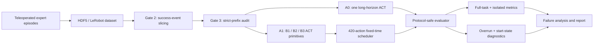

# PickOrange-ACT

### Auditable long-horizon imitation learning for an SO-101 robot arm

[](https://www.python.org/)
[](https://developer.nvidia.com/isaac/lab)
[](https://github.com/huggingface/lerobot)
[](LICENSE)

[中文说明](README.zh-CN.md) · [Full experiment report](docs/EXPERIMENT_REPORT.md) · [Reproduction guide](docs/REPRODUCIBILITY.md) · [Machine-readable results](results/summary.json)

PickOrange-ACT is an end-to-end embodied-AI experiment on a difficult
three-object pick-and-place task in [LeIsaac](https://github.com/LightwheelAI/leisaac).
It covers demonstration curation, event-based subtask slicing, ACT training,
resilient GPU orchestration, protocol-safe evaluation, and failure diagnosis.

The project is deliberately honest about negative results: a monolithic ACT
policy did not achieve a full three-orange success in the final 20-episode
evaluations, while a modular fixed-time three-policy system reached **3/20
(15%)**. Isolated primitives reached **30–50%**, showing that both contact-level
robustness and sequential state distribution shift remain limiting factors.

> **Why this is useful:** the repository is not only a model run. It is a
> reproducible investigation of why offline imitation loss can improve while
> closed-loop manipulation still fails—and a set of tools for measuring that
> gap without silently changing the protocol.

## Project at a glance

| Dimension | Implementation |
|---|---|
| Robot/task | SO-101, three oranges placed sequentially into a plate |
| Simulator | Isaac Lab through LeIsaac |
| Observations | Front RGB + wrist RGB + robot joint state |
| Actions | 6D direct joint-position targets |
| Policy | ACT, ResNet-18 visual encoder, chunk/action horizon 100 |
| Demonstrations | 30 expert episodes, audited after event-based slicing |
| Final training | Batch 64; A0 42k steps; each A1 primitive 14k steps |
| Formal evaluation | 20 episodes/configuration, seed 2026, Wilson 95% intervals |
| Main comparison | A0 monolithic policy vs A1 three-policy fixed-time scheduler |



## Key findings

### 1. Modularization produced observed full-task successes

The final native-horizon benchmark used 20 episodes for every configuration.
A0 executes 1,020 policy actions; A1 executes 420 actions per stage, or 1,260
actions total. These native horizons are reported explicitly and are not
silently treated as matched.


| Policy | Legacy | Intermediate 1 | Intermediate 2 | Final |
|---|---:|---:|---:|---:|
| A0, monolithic | 0/20 @ 21k | 0/20 @ 30k | 0/20 @ 36k | 0/20 @ 42k |
| A1, 3-policy | 0/20 @ 7k | 2/20 @ 10k | 0/20 @ 12k | **3/20 @ 14k** |

The A1 result is evidence that temporal decomposition can help this task, but
the wide Wilson interval for 3/20 (5.2–36.0%) means it should not be presented
as a precise estimate of deployment performance.

### 2. Primitive competence did not compose cleanly


B2 and B3 isolated evaluations use **oracle initialization**: already-completed
oranges are synthesized in the plate and the robot begins from the expert
subtask start state. These numbers are therefore capability upper bounds, not
sequential task success rates.

At 14k steps, B1/B2/B3 achieved 30%/45%/30%. Yet the complete A1 task achieved
15%, consistent with compounding primitive error and start-state shift between
stages. This is an interpretation of the measurements, not proof of causality.

### 3. The dataset itself was audited, not assumed correct

The B3 slice audit decoded observations and videos, checked finite state/action
values and timestamps, replayed strict-prefix semantics, and manually exposed
representative clips:

| B3 gate | Passed |
|---|---:|
| File/integrity checks | 30/30 |
| Target orange stably placed | 29/30 |
| Target + all prefix oranges intact | **28/30** |

Two episodes were excluded: one never stably placed Orange003; one damaged the
Orange002 prefix. The audit also found Orange003 releases at actions 350–358,
which invalidated the legacy 340-action truncation and motivated the corrected
420-action stage horizon.

[Watch a strict-prefix B3 expert clip](media/b3-strict-prefix-expert-demo.mp4) ·
[Open the 30-episode audit overview](assets/b3-audit-overview.jpg)

### 4. Fixed-time switching is now measurable

A1 is a fixed-time scheduler, not a success oracle. For each episode and stage,
the evaluator records the first target satisfaction, first stable satisfaction,
switch step, prefix integrity, failure reason, and:

```text
post_success_overrun = stage_switch_step - target_first_stably_satisfied_step
```

Observed median overruns were 14, 87.5, and 103 actions for B1/B2/B3 among
stages that reached stable success. No observed prefix was destroyed during
those overrun intervals. The correlation with next-stage start deviation uses
only seven pairs and is reported as descriptive—not causal.

## Engineering contributions

- **Event-aware data preparation:** slices are based on stable pick/place events
  and strict-prefix validity rather than fixed frame counts.
- **Protocol-safe evaluation:** named `native_horizon` and opt-in
  `matched_horizon`; outputs include the protocol name to prevent overwrites.
- **Initialization provenance:** full, isolated, and oracle-initialized runs
  receive explicit initialization IDs for paired analysis.
- **Raw diagnostic traces:** stage-start states and post-success overrun use
  separate JSONL outputs instead of overwriting aggregate summaries.
- **Failure-aware automation:** resumable pipeline state, completion markers,
  exponential retry, disk-space guards, and adaptive evaluation parallelism.
- **Checkpoint protection:** formal evaluators verify required checkpoints and
  do not delete them; smoke tests compare path, size, and modification time.
- **Statistical discipline:** Wilson intervals, exact paired tests and bootstrap
  hooks, with oracle and sequential evaluations kept semantically separate.

## Reproduce the analysis

The simulator and model checkpoints are intentionally not vendored. Start from
a compatible [LeIsaac installation](https://lightwheelai.github.io/leisaac/docs/getting-started/),
place this repository's `experiments/` directory at the LeIsaac project root,
and point the commands at local datasets/checkpoints.

```bash
python -m pip install -r requirements-analysis.txt
python -m pytest experiments/tests -q

# Safe by default: validates code, inputs, horizons, output isolation and
# checkpoint immutability without launching Isaac.
python experiments/smoke_pick_orange_eval_protocol.py --help

# Rebuild public result charts from results/summary.json.
python tools/render_result_charts.py
```

Actual Isaac smoke execution requires an explicit `--execute`; formal
20-episode evaluation is never started by the smoke command. See
[the reproduction guide](docs/REPRODUCIBILITY.md) for environment versions,
dataset contracts, native/matched-horizon commands and output layout.

## Repository map

```text
assets/        figures and audited contact-sheet overview
configs/       horizon and final-confirmation templates (disabled by default)
docs/          experiment report, design decisions and reproduction guide
experiments/   training, evaluation, auditing and resilient orchestration code
media/         one audited expert clip and one labeled policy-failure rollout
results/       compact summary plus sanitized raw machine-readable evidence
tools/         deterministic chart and public-repository validation scripts
```

## What the results do—and do not—show

- They show observed outcomes under a fixed simulator protocol and a single
  20-episode seed set; they do not establish real-world robot performance.
- `0/20` means no success was observed, not that the true success probability is
  mathematically zero.
- A0 and A1 native horizons differ. A matched-horizon mode exists but was not
  substituted for the historical benchmark.
- Isolated B2/B3 use oracle initialization and must not be compared as if they
  were end-to-end rollouts.
- No 50-demo result is reported: that extension was cancelled before use, so
  this repository is strictly the 30-demo study.

## Background and attribution

The experiment builds on [LeIsaac](https://github.com/LightwheelAI/leisaac),
[NVIDIA Isaac Lab](https://developer.nvidia.com/isaac/lab), and
[Hugging Face LeRobot](https://github.com/huggingface/lerobot). ACT was
introduced in [Learning Fine-Grained Bimanual Manipulation with Low-Cost
Hardware](https://arxiv.org/abs/2304.13705). See [NOTICE.md](NOTICE.md) and the
Apache-2.0 [LICENSE](LICENSE).

