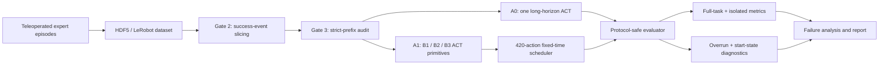
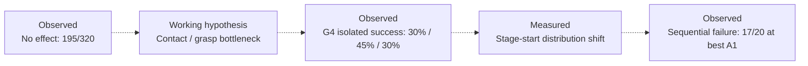
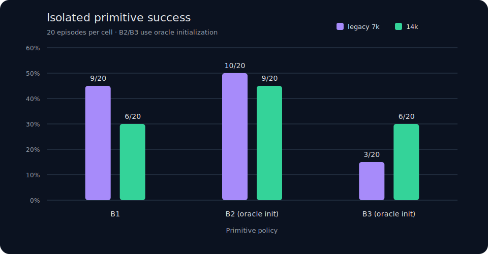

# PickOrange-ACT

### Auditable long-horizon imitation learning for an SO-101 robot arm

[](https://www.python.org/)
[](https://developer.nvidia.com/isaac/lab)
[](https://github.com/huggingface/lerobot)
[](LICENSE)
[](https://github.com/KQuaneo/pickorange-act-lab/actions/workflows/validate.yml)

[中文说明](README.zh-CN.md) · [Full experiment report](docs/EXPERIMENT_REPORT.md) · [Paired temporal aggregation](docs/TEMPORAL_AGGREGATION.md) · [Experiment index](docs/EXPERIMENT_INDEX.md) · [Reproduction guide](docs/REPRODUCIBILITY.md) · [Machine-readable results](results/summary.json)

PickOrange-ACT is an end-to-end embodied-AI experiment on a difficult
three-object pick-and-place task in [LeIsaac](https://github.com/LightwheelAI/leisaac).
It covers demonstration curation, event-based subtask slicing, ACT training,
resilient GPU orchestration, protocol-safe evaluation, and failure diagnosis.

The project is deliberately honest about negative results: a monolithic ACT
policy did not achieve a full three-orange success in the final 20-episode
evaluations, while a modular fixed-time three-policy system reached **3/20
(15%)**. Isolated primitives reached **30–45%**, showing that both contact-level
robustness and sequential state distribution shift remain limiting factors.

> **Why this is useful:** the repository is not only a model run. It is a
> reproducible investigation of why offline imitation loss can improve while
> closed-loop manipulation still fails—and a set of tools for measuring that
> gap without silently changing the protocol.

## Contribution vs result

| Algorithmic result | Main contribution |
|---|---|
| A0: **0/20** full-task successes<br>A1: best **3/20** full-task successes<br>No statistically conclusive superiority claim | Auditable, event-aware data pipeline<br>Protocol truncation bug discovery and correction<br>Long-horizon failure diagnosis<br>Restart-safe training and evaluation infrastructure |

The algorithmic result is intentionally modest. The transferable value is the
experimental system: it makes data validity, protocol changes, initialization
provenance and closed-loop failure modes inspectable instead of hiding them
behind a single success rate.

> **Claim boundary:** in the current `native_horizon` sample, A1 produced 3/20
> full-task successes while A0 produced 0/20. A0 ran for 1,020 policy actions
> and A1 for 1,260. The matched-horizon evaluator is implemented, but no formal
> matched 20-episode result is reported. This is an observed sample outcome,
> not evidence of statistically conclusive superiority.

## Project at a glance

| Dimension | Implementation |
|---|---|
| Robot/task | SO-101, three oranges placed sequentially into a plate |
| Simulator | Isaac Lab through LeIsaac |
| Observations | Front RGB + wrist RGB + robot joint state |
| Actions | 6D direct joint-position targets |
| Policy | ACT, ResNet-18, prediction chunk `K=100`; primary `H=100`, with post-hoc `H` and temporal-aggregation ablations |
| Demonstrations | 30 expert episodes, audited after event-based slicing |
| Final training | Batch 64; A0 42k steps; each A1 primitive 14k steps |
| Formal evaluation | 20 episodes/configuration, seed 2026, Wilson 95% intervals |
| Evaluation inventory | 1,160 rollout episodes across historical, diagnostic and final protocols |
| Main comparison | A0 monolithic policy vs A1 three-policy fixed-time scheduler |



## Failure-chain hypothesis



Dashed arrows denote a diagnosis to test, not an identified causal chain. The
evidence supports contact-level weakness and start-state shift as plausible
contributors, but the current 20-episode cells cannot isolate their causal
effects.

## Four training generations

Earlier runs are included, but assigned to different evidence tiers so protocol
changes are not hidden:

| Generation | What was trained | Scientific role |
|---|---|---|
| G1 | batch-128 A0/A1/A2; A3 reused A1; 24 train / 6 val | long-task and scheduler ablation |
| G2 | SingleOrange ACT with coupled chunk/execution horizons 25/50/100 | primitive-control diagnostic |
| G3 | batch-64 Gate30 A0 21k and A1 7k | historical 340-action protocol + corrected final-checkpoint re-evaluation |
| G4 | batch-64 A0 42k and strict-prefix A1 14k | primary final benchmark |

G3 adds an important historical observation: A1 achieved 1/20 at both 5k and
6k per primitive under the old 340×3 protocol, then 0/20 at 7k. These cells
support the non-monotonic checkpoint finding, but are not merged into the final
chart because G4 is an independent training run with 420×3 scheduling, stricter
B3 filtering and a non-paired initialization sequence. See the
[complete experiment index](docs/EXPERIMENT_INDEX.md).

## Key findings

### 1. A1 produced successes not observed for A0 in this sample

The final native-horizon benchmark used 20 episodes for every configuration.
A0 executes 1,020 policy actions; A1 executes 420 actions per stage, or 1,260
actions total. These native horizons are reported explicitly and are not
silently treated as matched.


| Policy | G4 checkpoint 1 | G4 checkpoint 2 | G4 checkpoint 3 |
|---|---:|---:|---:|
| A0, monolithic | 0/20 @ 30k | 0/20 @ 36k | 0/20 @ 42k |
| A1, 3-policy | 2/20 @ 10k | 0/20 @ 12k | **3/20 @ 14k** |

The primary chart contains only the protocol-consistent G4 benchmark. G3
results remain available as historical evidence in the
[complete experiment index](docs/EXPERIMENT_INDEX.md), not as a direct baseline.

The A1 run produced successes that were not observed for A0, but this does not
establish statistically conclusive superiority: native horizons are unmatched
and the Wilson interval for 3/20 is wide (5.2–36.0%).

### 2. Primitive reliability is itself a bottleneck



B2 and B3 isolated evaluations use **oracle initialization**: already-completed
oranges are synthesized in the plate and the robot begins from the expert
subtask start state. These numbers are therefore capability upper bounds, not
sequential task success rates.

At 14k steps, B1/B2/B3 achieved only 30%/45%/30%. B1 uses the normal task
initialization; B2/B3 use oracle initialization and are upper bounds under
easier start states. No primitive exceeded 45%, so end-to-end failure cannot be
attributed only to long-horizon composition. Low-level contact and grasp
reliability remain bottlenecks alongside compounding error and stage-start
shift. This is an interpretation of the measurements, not proof of causality.

### 3. The dataset itself was audited, not assumed correct

The B3 slice audit decoded observations and videos, checked finite state/action
values and timestamps, replayed strict-prefix semantics, and manually exposed
representative clips:

| B3 gate | Passed |
|---|---:|
| File/integrity checks | 30/30 |
| Target orange stably placed | 29/30 |
| Target + all prefix oranges intact | **28/30** |

Two episodes were excluded: one never stably placed Orange003; one damaged the
Orange002 prefix. The audit also found Orange003 releases at actions 350–358,
which invalidated the legacy 340-action truncation and motivated the corrected
420-action stage horizon.

[Watch a strict-prefix B3 expert clip](media/b3-strict-prefix-expert-demo.mp4) ·
[Open the 30-episode audit overview](assets/b3-audit-overview.jpg)

### 4. Fixed-time switching is now measurable

A1 is a fixed-time scheduler, not a success oracle. For each episode and stage,
the evaluator records the first target satisfaction, first stable satisfaction,
switch step, prefix integrity, failure reason, and:

```text
post_success_overrun = stage_switch_step - target_first_stably_satisfied_step
```

Observed median overruns were 14, 87.5, and 103 actions for B1/B2/B3 among
stages that reached stable success. No observed prefix was destroyed during
those overrun intervals. The correlation with next-stage start deviation uses
only seven pairs and is reported as descriptive—not causal.

### 5. Shorter execution horizons without temporal aggregation did not improve B1

A post-hoc inference ablation fixed the ACT prediction chunk at `K=100` and
varied only the number of actions executed before replanning. Every setting
used the G4 B1 14k checkpoint, 420 policy actions and 20 episodes.

| Execution horizon H | B1 success | Wilson 95% | Policy calls | Mean rollout time |
|---:|---:|---:|---:|---:|
| 100 | **5/20** | 11.2–46.9% | 100 | 33.84s |
| 25 | 3/20 | 5.2–36.0% | 340 | 33.45s |
| 10 | 2/20 | 2.8–30.1% | 840 | 30.54s |
| 1 | 1/20 | 0.9–23.6% | 8,400 | 49.43s |

The pre-registered lexicographic rule selected `H*=100`; no shorter execution
horizon improved observed success. Initialization IDs matched across all four
settings only for episode 0, so the table is a descriptive comparison and no
paired McNemar/bootstrap claim is made. The `H=1` success was final-in-plate at
the last step but did not satisfy the separate ten-step stable-placement
diagnostic, explaining why its failure-taxonomy label is
`high_lift_without_placement`.

The planned full A0/A1 follow-up was not run: `H*=100`, so comparing the
planned `H=100` baseline against `H*` would execute the same controller twice
and add no new experimental cell. This decision does not fill the separate
native-versus-matched total-horizon gap described above.

### 6. Temporal aggregation recovered H=1 to the paired H=100 level

A final inference-only study reused one fixed manifest of 20 simulator starts
to compare `H=100` without aggregation, `H=1` without aggregation, and `H=1`
with LeRobot ACT temporal aggregation (`coeff=0.01`). Unlike the earlier RHC
sweep, initialization IDs and restored robot/object/plate states matched for
all 20 episodes.


| Controller | B1 success | Wilson 95% | Contact-or-better | Calls/episode |
|---|---:|---:|---:|---:|
| `H=100`, aggregation off | 5/20 | 11.2–46.9% | 13/20 | 5 |
| `H=1`, aggregation off | 0/20 | 0.0–16.1% | 7/20 | 420 |
| `H=1`, aggregation 0.01 | 5/20 | 11.2–46.9% | 7/20 | 420 |

Aggregation produced five successes not observed for plain H=1 (exact McNemar
`p=0.0625`). Against H=100, both methods achieved 5/20; three successes were
shared and each had two exclusive successes (`p=1.0`). The supported claim is
therefore narrow: aggregation restored the observed H=1 success level to the
paired H=100 baseline, but did not outperform it. See the
[paired analysis](docs/TEMPORAL_AGGREGATION.md) for max lift, failure taxonomy,
action variation and episode-level transitions.

## Engineering contributions

- **Event-aware data preparation:** slices are based on stable pick/place events
  and strict-prefix validity rather than fixed frame counts.
- **Protocol-safe evaluation:** named `native_horizon` and opt-in
  `matched_horizon`; outputs include the protocol name to prevent overwrites.
- **Initialization provenance:** full, isolated, and oracle-initialized runs
  receive explicit initialization IDs for paired analysis.
- **Raw diagnostic traces:** stage-start states and post-success overrun use
  separate JSONL outputs instead of overwriting aggregate summaries.
- **Failure-aware automation:** resumable pipeline state, completion markers,
  exponential retry, disk-space guards, and adaptive evaluation parallelism.
- **Checkpoint protection:** formal evaluators verify required checkpoints and
  do not delete them; smoke tests compare path, size, and modification time.
- **Statistical discipline:** Wilson intervals, exact paired tests and bootstrap
  hooks, with oracle and sequential evaluations kept semantically separate.

## Practical outcomes

- Established a reusable ACT experiment template for future LeIsaac tasks.
- Identified evaluation truncation and invalid expert-data slices before they
  could be mistaken for policy failures.
- Added restart-safe orchestration and checkpoint-safe evaluation for long GPU
  experiments.
- Produced reusable stage-transition, overrun and initialization diagnostics
  that can transfer to later simulated or hardware manipulation tasks.

## Reproduce the analysis

The simulator and model checkpoints are intentionally not vendored. Start from
a compatible [LeIsaac installation](https://lightwheelai.github.io/leisaac/docs/getting-started/),
place this repository's `experiments/` directory at the LeIsaac project root,
and point the commands at local datasets/checkpoints.

```bash
python -m pip install -r requirements-analysis.txt
python -m pytest experiments/tests -q
python tools/validate_public_repo.py

# Safe by default: validates code, inputs, horizons, output isolation and
# checkpoint immutability without launching Isaac.
python experiments/smoke_pick_orange_eval_protocol.py --help

# Rebuild public result charts from results/summary.json.
python tools/render_result_charts.py
```

Actual Isaac smoke execution requires an explicit `--execute`; formal
20-episode evaluation is never started by the smoke command. See
[the reproduction guide](docs/REPRODUCIBILITY.md) for environment versions,
dataset contracts, native/matched-horizon commands and output layout.

## Repository map

```text
assets/        figures and audited contact-sheet overview
configs/       horizon and final-confirmation templates (disabled by default)
docs/          experiment report, design decisions and reproduction guide
experiments/   training, evaluation, auditing and resilient orchestration code
media/         one audited expert clip and one labeled policy-failure rollout
results/       compact summary plus sanitized raw machine-readable evidence
tools/         deterministic chart and public-repository validation scripts
```

## What the results do—and do not—show

- They show observed outcomes under a fixed simulator protocol and a single
  20-episode seed set; they do not establish real-world robot performance.
- `0/20` means no success was observed, not that the true success probability is
  mathematically zero.
- A0 and A1 native horizons differ. A matched-horizon mode exists but was not
  substituted for the historical benchmark, and no formal matched 20-episode
  result is available.
- Isolated B2/B3 use oracle initialization and must not be compared as if they
  were end-to-end rollouts.
- G4 primitive success is 30%/45%/30%; composition is not the only unresolved
  problem because the underlying primitives are themselves unreliable.
- No 50-demo result is reported: that extension was cancelled before use, so
  this repository is strictly the 30-demo study.
- The RHC B1 sweep is descriptive rather than paired because initialization
  alignment failed after episode 0; `H*=100` is an exploratory selection.
- The later temporal-aggregation comparison is physically paired 20/20, but
  separate Isaac launches were not pixel-identical. Its 20-episode result is a
  checkpoint-specific observation, not a general ACT controller ranking.

## Background and attribution

The experiment builds on [LeIsaac](https://github.com/LightwheelAI/leisaac),
[NVIDIA Isaac Lab](https://developer.nvidia.com/isaac/lab), and
[Hugging Face LeRobot](https://github.com/huggingface/lerobot). ACT was
introduced in [Learning Fine-Grained Bimanual Manipulation with Low-Cost
Hardware](https://arxiv.org/abs/2304.13705). See [NOTICE.md](NOTICE.md) and the
Apache-2.0 [LICENSE](LICENSE).
