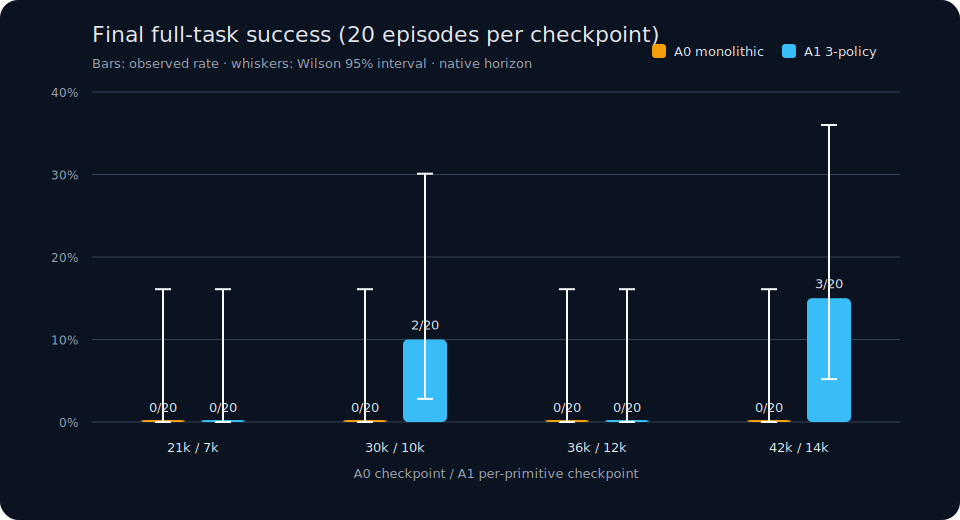
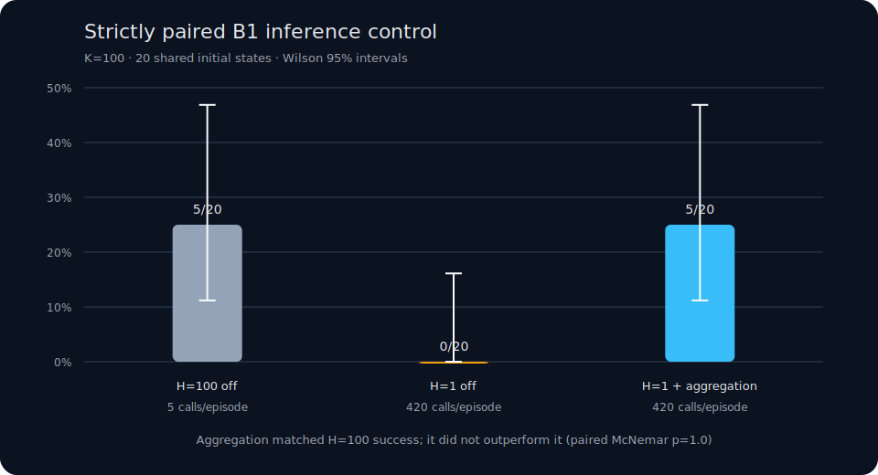

# PickOrange-ACT：可审计的长时序具身智能实验

[English](README.md) · [完整实验报告](docs/EXPERIMENT_REPORT.md) · [Temporal Aggregation](docs/TEMPORAL_AGGREGATION.md) · [全部实验索引](docs/EXPERIMENT_INDEX.md) · [复现说明](docs/REPRODUCIBILITY.md) · [机器可读结果](results/summary.json)

这是一个基于 LeIsaac、Isaac Lab 和 LeRobot ACT 的 SO-101 三橘子长时序
抓取放置项目。项目覆盖专家数据采集与切片、严格前缀审计、ACT 训练、GPU
容错流水线、协议安全测评和失败归因，而不是只展示一次成功视频。

## 最重要的结果

- 30 条专家数据；最终每个配置评测 20 episodes，seed=2026。
- 四代训练与诊断累计保存了 1,160 个 rollout episode 的汇总；不同协议不混合计算成功率。
- G4 单策略 A0 在 30k/36k/42k 均为 0/20。
- 三子策略固定时间调度 A1 在 10k 达到 2/20，在 14k 达到 **3/20=15%**。
- isolated B1/B2/B3 在 14k 分别为 30%/45%/30%；B2/B3 是 oracle 初始化，
  只能视为理想前置状态下的 primitive 能力上限。
- B3 数据审计为 integrity 30/30、target success 29/30、strict-prefix
  success 28/30，排除了两条语义不合格数据。
- 审计发现第三次释放发生在 350–358 actions，证明旧的 340-action 切片会
  截断关键动作，因此正式 A1 改为每阶段 420 actions。
- 中间 Gate30 训练在旧 340×3 协议下，A1 5k 和 6k 都出现过 1/20，7k
  回落到 0/20。该结果只保留在历史索引中，不作为最终 420×3 主结果的直接基线。

## 贡献与结果

| 算法结果 | 项目主要贡献 |
|---|---|
| A0 完整任务 0/20 A1 最佳完整任务 3/20 不主张统计上已确定的算法优势 | 可审计、事件驱动的数据流水线 发现并修复测评截断协议错误 长时序失败诊断 可恢复的训练与测评基础设施 |

本项目不依靠 15% 的成功率包装算法突破；核心价值是把数据有效性、测评协议、
初始化来源和闭环失败链路变成可以复核与复用的工程资产。

> **结论边界：** 当前 `native_horizon` 样本中，A1 完整成功 3/20，A0 为
> 0/20；但 A0 执行 1,020 policy actions，A1 执行 1,260。matched-horizon
> 能力已经实现，却尚无正式 20-episode 结果。因此只能报告样本内观察，不能
> 声称多策略分解在统计上显著优于单策略。

## 失败链路工作假设

虚线表示待验证的诊断假设，而不是已经识别的因果关系。

同时，G4 的 B1/B2/B3 仅为 30%/45%/30%，且 B2/B3 使用 oracle 初始化。
底层 primitive 本身尚不可靠，因此完整任务失败不能全部归因于长时序组合；
接触、抓取、阶段衔接和误差累积都是尚未解决的问题。

## 项目体现的能力

1. **研究设计**：A0/A1/A2/A3、isolated primitives、SingleOrange 耦合
   chunk/execution horizon sweep 和 checkpoint 对比，区分规划、低层控制与阶段衔接问题。
2. **数据工程**：按稳定抓取/放置事件切片，检查目标成功与所有前缀橘子是否
   仍在盘中，而不是把固定帧数当作成功标签。
3. **评测工程**：显式区分 `native_horizon` 与可选 `matched_horizon`，记录
   action 数、simulation steps、理论时间和初始化来源，避免静默覆盖历史结果。
4. **诊断能力**：记录 fixed-time scheduler 的 post-success overrun、阶段
   start-state deviation、prefix 破坏与失败原因。
5. **系统可靠性**：所有长流程使用 tmux/supervisor，支持完成标志、断点复用、
   OOM 后降低并行度、指数退避、磁盘保护和自动衔接下一阶段。
6. **科研诚信**：保留 0/20 和宽置信区间，不把 isolated oracle 结果包装成
   端到端成功，也不报告已取消的 50-demo 实验。

## 实际产出

- 建立可复用于其他 LeIsaac 任务的 ACT 实验模板。
- 在把问题误判为策略失败前，发现测评截断和无效专家切片。
- 为长时间 GPU 实验加入可恢复调度和 checkpoint 安全测评。
- 产出可迁移到后续仿真或真机任务的阶段切换、overrun 与初始化诊断。

## RHC 推理消融

在不重新训练的前提下，实验固定 ACT 预测块 `K=100`，只改变每次重规划前
实际执行的动作数 `H`。G4 B1 14k checkpoint 的 20-episode 结果为：

| H | B1 成功 | policy calls |
|---:|---:|---:|
| 100 | **5/20** | 100 |
| 25 | 3/20 | 340 |
| 10 | 2/20 | 840 |
| 1 | 1/20 | 8,400 |

预注册选择规则得到 `H*=100`，未观察到更短执行时域带来改善。四组中只有
episode 0 的初始化完全对齐，因此这是描述性对比，不使用配对 McNemar 或
bootstrap 推断。计划中的完整 A0/A1 后续没有运行：`H*=100`，所以
“`H=100` vs `H*`”会完全重复基线，不产生新实验单元。这不等于已解决
A0/A1 native horizon 不一致的 matched-horizon 问题。

## Temporal Aggregation 严格配对实验

最后一组推理实验复用同一份 20 个初始化状态，严格配对比较：

| 控制器 | B1 成功 | Wilson 95% | contact-or-better | 每回合调用 |
|---|---:|---:|---:|---:|
| `H=100`，aggregation off | 5/20 | 11.2–46.9% | 13/20 | 5 |
| `H=1`，aggregation off | 0/20 | 0.0–16.1% | 7/20 | 420 |
| `H=1`，aggregation 0.01 | 5/20 | 11.2–46.9% | 7/20 | 420 |

Aggregation 相对纯 H=1 产生了 5 个新增成功，exact McNemar `p=0.0625`；
它与 H=100 都是 5/20，双方各有 2 个独占成功，`p=1.0`。因此只能说
aggregation 把当前样本中的 H=1 表现恢复到 H=100 的观察水平，不能说它
优于 H=100。20/20 个 initialization ID、机器人和物体状态都已配对；不同
Isaac 进程的相机像素并非逐像素相同，作为显式渲染限制保留。完整分析见
[Temporal Aggregation 报告](docs/TEMPORAL_AGGREGATION.md)。

## 结论

在当前样本中，多策略系统产生了单策略未观察到的完整成功，但不同 native
horizon、缺少正式 matched-horizon 结果和宽置信区间，使其不能被解释为显著
算法优势。低层 primitive 也尚不可靠；接触鲁棒性、固定时间切换造成的阶段
尾部空转，以及前一阶段误差导致的 start-state 分布漂移都值得继续研究。当前
数据只支持样本内观察、相关性和工程诊断，不支持强因果结论。

代码入口和运行方式见 [复现说明](docs/REPRODUCIBILITY.md)，完整实验演进与限制见
[统一报告](docs/EXPERIMENT_REPORT.md)。
