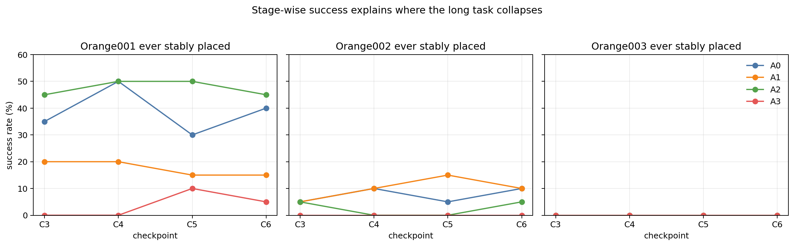
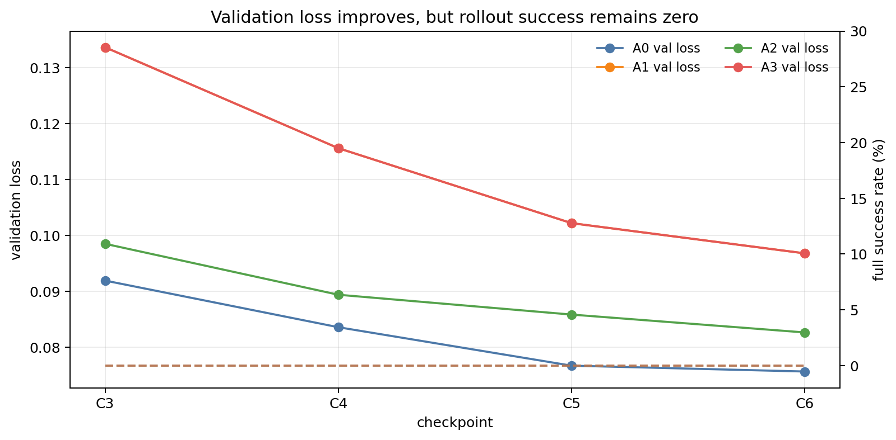
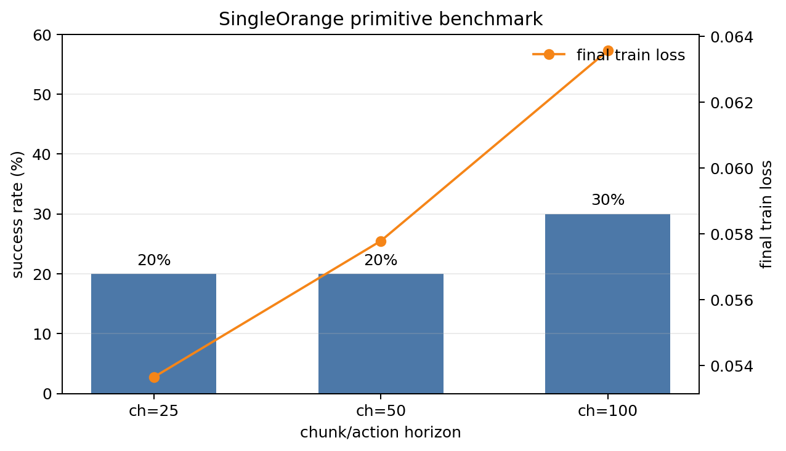
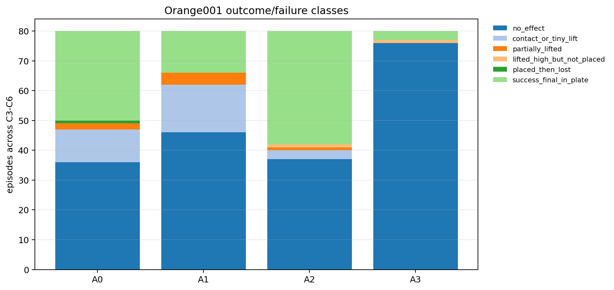
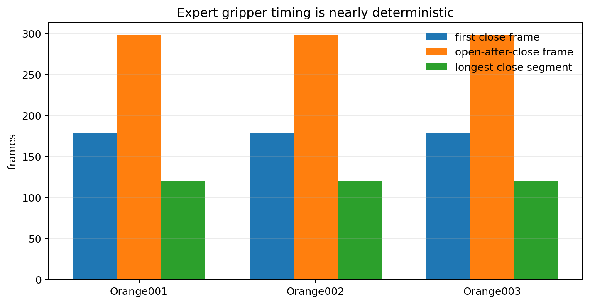

# PickOrange-ACT unified experiment report

**Study scope:** 30 expert demonstrations, simulation only  
**Task:** `LeIsaac-SO101-PickOrange-v0`  
**Final evaluation seed:** 2026  
**Report date:** 2026-07-14

## Executive summary

This study asks a practical embodied-AI question: when an ACT policy fails on a
long, contact-rich manipulation task, is the main limitation long-horizon task
structure, primitive control, data quality, or stage transition behavior?

The investigation progressed from a monolithic ACT baseline to explicit stage
conditioning, multiple primitive policies, isolated oracle-initialized tests,
single-orange horizon sweeps, strict-prefix data audits, doubled-step training,
and fixed-time scheduler diagnostics.

The strongest observed full-task result was **3/20 (15%)** from the final A1
three-policy system. No full success was observed for A0 at any final
checkpoint. Isolated primitives achieved 30–50%, so primitive capability was
real but did not compose reliably. A data audit rejected 2/30 B3 slices and
identified releases after the former 340-action cutoff. These findings led to a
420-action stage horizon and explicit scheduler-overrun measurement.

The outcome is a technically meaningful partial success, not a solved task.
The main contribution is the evidence chain connecting data semantics,
low-level contact behavior, scheduling, horizon fairness and end-to-end outcome.

## 1. Task and model

The SO-101 arm must sequentially pick three oranges from a tabletop and place
all three in a plate. The final success condition is evaluated from simulator
state: every orange must be inside the plate tolerance at the final step and
must satisfy a 10-frame stable placement condition. Robot rest is not required
by this evaluator.

| Item | Setting |
|---|---|
| Observations | front RGB, wrist RGB, robot joint state |
| Images | 480×640, 30 FPS expert data |
| Action | six direct joint-position targets; no IK |
| Policy | ACT with ResNet-18 visual encoder |
| Chunk / action horizon | 100 / 100 |
| Final batch size | 64 |
| Final A0 training | 42,000 steps; retained 30k/36k/42k |
| Final A1 training | 14,000 steps per primitive; retained 10k/12k/14k |
| Formal rollout | 20 episodes/configuration, seed 2026 |

## 2. Experimental questions and groups

| Group | Training | Inference | Question |
|---|---|---|---|
| A0 | one ACT on the full episode | one policy, start to finish | Can vanilla ACT solve the long task? |
| A1 | separate B1/B2/B3 ACT policies | fixed-time scheduler | Does temporal decomposition help? |
| A2 | one ACT plus stage/target features | oracle stage feature | Is stage ambiguity the main problem? |
| A3 | reuse A1 primitive policies | privileged success detector | Does event-triggered switching help? |
| B1/B2/B3 | isolated A1 primitives | B2/B3 oracle initialized | What is the primitive capability ceiling? |
| C0/C1 | single-orange ACT | chunk/horizon sweep | Is local execution horizon the bottleneck? |

The word “oracle” is intentionally narrow. A1 full-task inference uses fixed
time boundaries and is not a success oracle. A2 receives a privileged stage
identifier. A3 uses simulator state for switching. Isolated B2/B3 synthesize a
successful prefix and therefore cannot be interpreted as sequential rollouts.

### 2.1 Training lineage and comparison policy

The completed work contains four training generations rather than one run:

| Generation | Training | Protocol role |
|---|---|---|
| G1 | batch-128 A0/A2 to 21k and B1/B2/B3 to 7k; 24 train / 6 validation | A0–A3 methodological ablation |
| G2 | three batch-128 SingleOrange policies to 7k | action-horizon diagnostic |
| G3 | batch-64 Gate30 A0 to 21k and B1/B2/B3 to 7k | legacy 340-action history; final checkpoints also re-evaluated at 420 |
| G4 | batch-64 A0 to 42k and strict-prefix B1/B2/B3 to 14k | primary final benchmark |

The summaries cover 1,020 rollout episodes across historical, diagnostic and
final protocols. This demonstrates evaluation scope but is not one statistical
sample; rates are never pooled across incompatible cells.

G3 A1 produced 1/20 full success at 5k and 6k per primitive under the legacy
340×3 protocol, followed by 0/20 at 7k. This evidence is worth preserving
because it predates the final doubled-step run and reinforces non-monotonic
checkpoint behavior. It remains outside the main bar chart because G4 changed
the stage horizon to 420 and tightened B3 from 29 target-success slices to 28
strict-prefix slices. The G3 final 7k policies were separately re-evaluated at
420×3 and again achieved 0/20.

See the [complete experiment index](EXPERIMENT_INDEX.md) for the inclusion
decision and the exact historical checkpoint table.

## 3. Experiment sequence

### 3.1 Data/schema and replay gates

Before training, the workflow validated the task schema, HDF5-to-LeRobot
conversion, scene alignment and successful replay semantics. Later preparation
used event-based stable placement rather than an assumed fixed number of frames.

The final ACT sampling accounting treats every frame as a sample anchor; future
actions at episode ends are padded. For that reason, “30 episodes” alone is not
a sufficient exposure measure.

| Dataset | Strict episodes | Anchors | Full unpadded windows | Approx. anchor exposure |
|---|---:|---:|---:|---:|
| A0 full | 30 | 35,040 | 32,070 | 76.71× |
| B1 / Orange001 | 30 | 9,431 | 6,461 | 95.01× |
| B2 / Orange002 | 30 | 11,068 | 8,098 | 80.95× |
| B3 / Orange003 | 28 | 11,014 | 8,242 | 81.35× |

### 3.2 Legacy long-task ablation: A0–A3

The first formal study trained A0/A2 to 21k steps and each A1 primitive to 7k
steps at batch 128. Four aligned checkpoint levels were evaluated with 20
episodes each. No group produced an observed full three-orange success.

| Group | Best Orange001 | Best Orange002 | Best Orange003 | Full success observed |
|---|---:|---:|---:|---:|
| A0 | 50% | 10% | 0% | 0/20 per checkpoint |
| A1 | 20% | 15% | 0% | 0/20 per checkpoint |
| A2 | 50% | 5% | 0% | 0/20 per checkpoint |
| A3 | 10% | 0% | 0% | 0/20 per checkpoint |



Training and validation loss decreased, but rollout success did not track it.
This is evidence of an offline-to-closed-loop gap under the tested setup; it
does not isolate whether the cause is vision, action averaging, dynamics,
contact timing or data coverage.



A2 did not outperform A0 despite explicit stage information. A3 usually could
not trigger a reliable first-stage success event. Together these observations
weakened—but did not eliminate—the hypothesis that stage identity alone was the
dominant limitation.

### 3.3 Isolated primitive evaluation

The A1 policies were then evaluated separately. B1 starts from the normal task
initialization. B2/B3 use oracle initialization with already-completed oranges
placed in the plate, robot joints set to the corresponding expert subtask start,
and camera observations rendered after the synthetic state is applied.

The legacy final 7k primitives achieved 45%/50%/15% for B1/B2/B3. Earlier
checkpoint sweeps produced legacy best values of 45%/40%/25%, which are retained
in the historical raw results; the later final-protocol comparison reran the
7k family and is the source of the 45%/50%/15% table used in this repository.

This distinction matters: isolated success quantifies primitive capability in
a controlled start-state distribution, not the probability that three
primitives will succeed in sequence.

### 3.4 SingleOrange horizon sweep

Orange001 was trained/evaluated as a standalone primitive with chunk/action
horizons 25, 50 and 100.

| Horizon | Success |
|---:|---:|
| 25 | 4/20 (20%) |
| 50 | 4/20 (20%) |
| 100 | 6/20 (30%) |



The comparison is diagnostic rather than an equal-compute architecture
ablation: changing action horizon also changes control refresh, smoothing and
contact response. Under the tested settings, simply shortening the horizon did
not improve success.

### 3.5 Failure taxonomy and gripper timing

Across 320 Orange001 outcomes, 195 (60.9%) were classified as `no_effect`, 30
as contact/tiny lift, seven as partial lift, two as high lift without placement,
one as placed then lost and 85 as final success.



Expert sequences shared a highly regular gripper schedule: first close around
frame 178, a longest closed segment around 120 frames, and reopening around
frame 298. The combination of frequent no-effect failures and fixed timing is
consistent with sensitivity to spatial trajectory error. This is an engineering
hypothesis supported by the observed pattern, not a controlled causal result.



### 3.6 Strict-prefix B3 audit

The weak legacy B3 outcome motivated a complete audit of the third-orange
training slices. The audit checked decoded video/frame counts, finite arrays,
timestamp continuity, target stable placement and preservation of every prior
orange.

| Check | Result |
|---|---:|
| Integrity | 30/30 |
| Orange003 target success | 29/30 |
| Strict-prefix success | 28/30 |

The two rejections were `target_not_stably_placed` and
`prefix_not_intact:Orange002`. More importantly, valid B3 release actions were
observed at 350–358, after the legacy 340-action boundary. The final experiment
therefore uses 420 actions per A1 stage; historical 340-action results remain
separately labeled rather than silently rewritten.

### 3.7 Doubled-step final experiment

The final study kept batch size 64 and the 30-demo dataset fixed. A0 was trained
to 42k; each A1 primitive to 14k. Only three new checkpoints were retained, with
the legacy final checkpoint added to evaluation for a four-point comparison.

| Method | Checkpoint | Full success | Wilson 95% | Mean final oranges |
|---|---:|---:|---:|---:|
| A0 | 21k legacy | 0/20 | 0.0–16.1% | 0.60 |
| A0 | 30k | 0/20 | 0.0–16.1% | 0.70 |
| A0 | 36k | 0/20 | 0.0–16.1% | 0.55 |
| A0 | 42k | 0/20 | 0.0–16.1% | 0.35 |
| A1 | 7k legacy | 0/20 | 0.0–16.1% | 0.60 |
| A1 | 10k | 2/20 | 2.8–30.1% | 0.65 |
| A1 | 12k | 0/20 | 0.0–16.1% | 0.70 |
| A1 | 14k | **3/20** | **5.2–36.0%** | **0.75** |

The non-monotonic 10k/12k/14k result is another warning that training loss or
step count alone is not a reliable model-selection signal for contact-rich
rollouts. With 20 episodes, apparent differences have substantial uncertainty.

The final isolated comparison was:

| Primitive | Legacy 7k | 14k |
|---|---:|---:|
| B1 | 9/20 (45%) | 6/20 (30%) |
| B2, oracle initialized | 10/20 (50%) | 9/20 (45%) |
| B3, oracle initialized | 3/20 (15%) | 6/20 (30%) |

### 3.8 Native versus matched horizon

The historical/final default remains `native_horizon`:

| Protocol | A0 | A1 | Same total horizon? |
|---|---:|---:|---|
| `native_horizon` | 1,020 actions / 2,040 sim steps / 34s | 420×3 / 2,520 sim steps / 42s | No |
| `matched_horizon` | 1,260 actions / 2,520 sim steps / 42s | 420×3 / 2,520 sim steps / 42s | Yes |

`matched_horizon` is an opt-in evaluator capability. It was not substituted for
the reported historical benchmark and has no formal 20-episode result in this
study. Output paths and protocol-specific summary names prevent accidental
overwrites.

### 3.9 Fixed-time scheduler overrun

For a stage that becomes stably successful before its fixed boundary:

```text
post_success_overrun = stage_switch_step - target_first_stably_satisfied_step
```

If stable success is never reached, the satisfaction and overrun fields are
JSON `null`, not zero.

| Stage | n | Mean | Median | Q25–Q75 | Prefix destroyed during overrun |
|---|---:|---:|---:|---:|---:|
| Orange001 | 3 | 63.67 | 14.0 | 13.0–89.5 | 0 |
| Orange002 | 4 | 89.75 | 87.5 | 81.5–95.75 | 0 |
| Orange003 | 7 | 97.71 | 103.0 | 27.5–120.0 | 0 |

Seven overrun/next-stage-deviation pairs yielded Pearson r≈0.632. The sample is
small and one normalized stage-deviation family is numerically sensitive to
near-zero expert variance. The result is therefore retained only as a
descriptive diagnostic; no causal or robust inferential claim is made.

## 4. Automation and operational reliability

Long-running work was executed under tmux with a supervisor and live status
writer. Training used two stable GPU lanes: one A0 lane and one sequential A1
lane. Evaluation used up to three parallel jobs. The final 30-demo pipeline:

- persists a state JSON and completion markers;
- reuses completed summaries on restart;
- lowers evaluation parallelism after failure;
- uses bounded exponential retry delays;
- waits on low disk capacity rather than failing mid-run;
- separates smoke, formal evaluation and public report outputs;
- validates the exact retained-checkpoint set.

The cancelled 50-demo extension was removed from the active pipeline. No
50-demo result is used anywhere in this report.

## 5. Interpretation

The evidence supports four measured conclusions:

1. Temporal decomposition produced observed end-to-end successes under the
   corrected A1 protocol, whereas A0 did not in these evaluation samples.
2. Primitive policies remain unreliable even under controlled initialization;
   this alone makes long sequential success difficult.
3. Stage transitions are not merely a software detail: success can occur long
   before the fixed boundary, while valid B3 releases can occur after the old
   boundary.
4. Dataset semantics materially affect the experiment. A small nominal dataset
   required strict-prefix filtering and exposure accounting at the frame/window
   level.

The experiment does not prove that fixed-time overrun causes the next stage to
fail, that A1 is statistically superior in general, or that the policies will
transfer to hardware.

## 6. Recommended next experiments

1. Freeze the current protocol and repeat A0/A1 with additional independent
   seeds before selecting a winner.
2. Run the opt-in A0 matched-horizon diagnostic to isolate the eight-second
   native-horizon difference.
3. Replace fixed-time switching with a non-privileged visual success detector
   only after primitive reliability improves.
4. Increase demonstration diversity around failed contact modes rather than
   only increasing identical trajectory count.
5. Separate ACT chunk size from execution horizon in a controlled ablation.
6. Add closed-loop gripper/contact logic or a residual controller and compare
   against the current position-only execution.
7. Evaluate on physical SO-101 hardware before making any sim-to-real claim.

## 7. Evidence index

- Public compact result: [`results/summary.json`](../results/summary.json)
- Sanitized raw results: [`results/raw/`](../results/raw/)
- Evaluators: [`experiments/eval_pick_orange_joint6_ablation.py`](../experiments/eval_pick_orange_joint6_ablation.py)
- Strict B3 audit: [`experiments/audit_pick_orange_b3_slices.py`](../experiments/audit_pick_orange_b3_slices.py)
- Statistical helpers: [`experiments/pick_orange_analysis.py`](../experiments/pick_orange_analysis.py)
- Resilient pipeline: [`experiments/run_pick_orange_30_only_pipeline.py`](../experiments/run_pick_orange_30_only_pipeline.py)
