# System design

## Data contracts

The experiment layer assumes a LeIsaac project root containing:

```text
data/lerobot/local/<dataset>/
outputs/train/<run>/checkpoints/<step>/pretrained_model/
outputs/eval/
outputs/audits/
```

Large datasets and checkpoints are runtime inputs and are ignored by Git. The
published code discovers its project root relative to each script instead of
embedding a server home directory.

## Training topology

Final training used two concurrent lanes because this was the stable operating
point for the available GPU:

```text
lane 1: A0  ─────────────────────────────── 42k
lane 2: B1 ───────── 14k → B2 ───── 14k → B3 ───── 14k
```

Only the last three new checkpoints were retained: A0 30k/36k/42k and each A1
primitive 10k/12k/14k. Legacy 21k and 7k checkpoints were evaluated alongside
them, not overwritten.

The public shell scripts preserve the original resume and checkpoint-validation
logic. `train_pick_orange_double_steps.sh` also prunes transient recovery
checkpoints inside the selected output run; review the target output directory
before running it on a new installation.

## Evaluation topology

The evaluation driver allows up to three concurrent jobs. A completed summary
is reused on retry. Formal runs are named by method, checkpoint and horizon
protocol. Smoke runs always write below `outputs/smoke/` and never participate
in formal aggregation.

The evaluator records:

- episode, seed and initialization ID;
- policy actions, simulation steps and theoretical time;
- full and per-orange success;
- start-state provenance and deviation;
- stage outcomes, failure reasons and prefix integrity;
- target satisfaction, stable satisfaction, switch and overrun steps.

## Failure recovery

`run_pick_orange_30_only_pipeline.py` is a small persistent state machine:

```mermaid
stateDiagram-v2
    [*] --> Evaluate30
    Evaluate30 --> WaitForDisk: free space below threshold
    WaitForDisk --> Evaluate30
    Evaluate30 --> Retry: non-zero exit
    Retry --> Evaluate30: backoff; reduce parallelism
    Evaluate30 --> Report30: DONE marker
    Report30 --> RetryReport: non-zero exit
    RetryReport --> Report30
    Report30 --> Complete: report DONE marker
    Complete --> [*]
```



The state file is written through a temporary file and atomic replacement.
Subprocesses start in a new session, so the pipeline does not depend on an SSH
terminal remaining connected.

## Safety boundaries

- `matched_horizon`, real smoke execution and final confirmation are disabled by
  default.
- Real smoke requires `--execute`.
- Checkpoint fingerprints are compared around smoke tests.
- Formal evaluators do not delete checkpoint files.
- Isolated initialization is explicitly labeled and receives a distinct ID.
- Missing stable success becomes `null`, avoiding false zero-overrun records.

